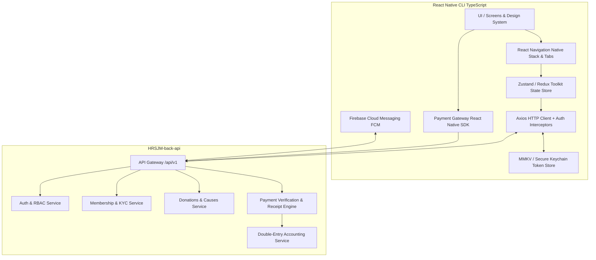
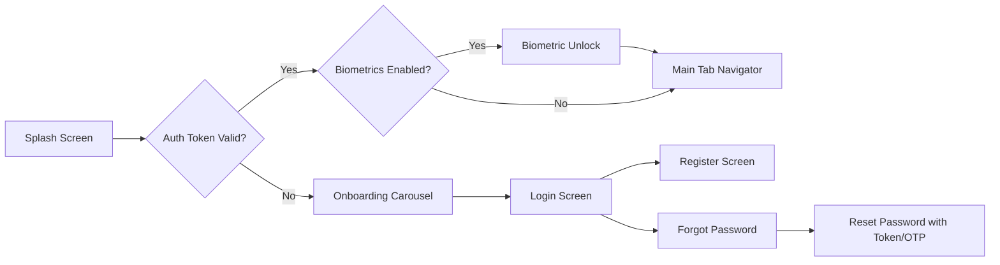
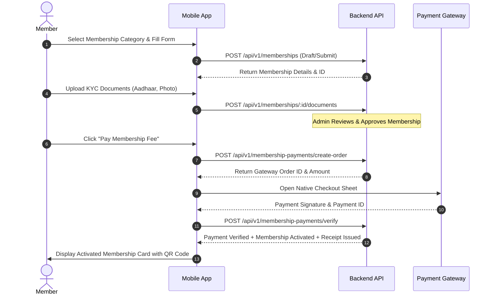
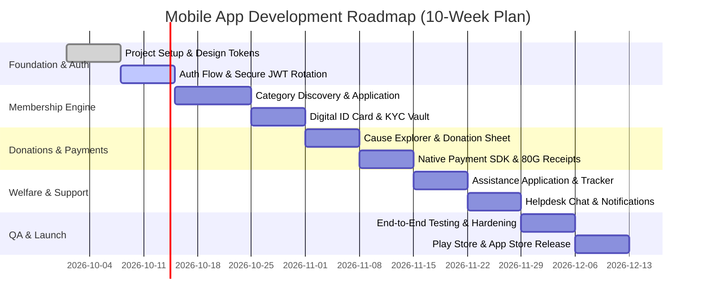

# Business Requirement Document (BRD)
## HRSJM Digital Membership & Donation Mobile Application
### Target Framework: React Native CLI (iOS & Android)

---

## Document Control

| Attribute | Details |
|---|---|
| **Document Title** | Business Requirement Document (BRD) — Mobile Application |
| **Project Name** | HRSJM Digital Membership & Donation Platform (HRSJM-UI) |
| **Target Platforms** | Android (min SDK 24 / target SDK 34) & iOS (iOS 15.0+) |
| **Framework** | **React Native CLI (TypeScript)** |
| **Backend API Reference** | `HRSJM-back-api` (`/api/v1`) |
| **Document Version** | 1.0.0 |
| **Date** | September 2026 |
| **Target Audience** | Mobile Engineers, UI/UX Designers, Product Managers, QA Engineers |

---

## 1. Executive Summary & Product Vision

### 1.1 Overview
The **HRSJM Mobile Application** is a unified cross-platform mobile solution designed for community members, charitable donors, welfare seekers, and public supporters. The mobile application integrates directly with the **HRSJM Backend REST API (`/api/v1`)** to provide digital onboarding, membership tier subscriptions, payment gateway processing, instant receipt issuance, verified welfare assistance applications, and in-app support.

### 1.2 Core Objectives
- **Frictionless Digital Onboarding**: Fast registration, secure JWT authentication with SHA-256 token rotation, and biometric authentication (Face ID / Fingerprint).
- **Membership Management**: Tier discovery, multi-step application workflow, KYC document upload, membership card with dynamic QR code, and automated renewal triggers.
- **Donation & Cause Fundraising**: Campaign browsing, one-click payment checkout, transparent cause tracking, and immediate 80G tax receipt PDF generation.
- **Welfare Assistance Gateway**: Dedicated workflow for individuals seeking educational, medical, or financial aid with document verification and real-time status tracking.
- **Integrated Support & Helpdesk**: Ticket generation with threaded messaging and photo attachments.
- **Offline & Low-Bandwidth Resilience**: Optimistic caching, local storage via MMKV, and clear network connectivity indicators.

---

## 2. Technical Stack & Architectural Blueprint



### 2.1 Recommended Mobile Technology Stack

| Component | Library / Technology | Justification |
|---|---|---|
| **Core Framework** | `React Native CLI (0.74+)` + `TypeScript` | Native performance, deep device API integration, no Expo build constraints. |
| **Navigation** | `@react-navigation/native` + `@react-navigation/native-stack` + `@react-navigation/bottom-tabs` | Standard native navigation, smooth 60fps transitions. |
| **State Management** | `Zustand` or `@reduxjs/toolkit` + `TanStack Query (React Query v5)` | Server-state caching, automatic refetching, mutation lifecycle, minimal boilerplate. |
| **Secure Storage** | `react-native-keychain` + `react-native-mmkv` | Ultra-fast synchronous storage for cache + hardware-backed secure enclave for JWT tokens. |
| **Networking** | `axios` | Configurable interceptors for automatic JWT refresh rotation, request signing, and response normalization. |
| **Forms & Validation** | `react-hook-form` + `zod` | High-performance un-rendered form inputs and strict TypeScript schema validation matching backend DTOs. |
| **UI Components & Icons** | Custom Design System + `react-native-vector-icons` + `react-native-svg` | Tailored brand aesthetics with smooth glassmorphism, gradients, and custom components. |
| **Payment Gateway** | `react-native-razorpay` / Cashfree / Stripe SDK | Server-order checkout and client-side signature collection. |
| **Document/Image Handling** | `react-native-image-picker`, `react-native-document-picker`, `react-native-blob-util`, `react-native-pdf` | KYC document scanning, PDF preview, and direct receipt downloads. |
| **Push Notifications** | `@react-native-firebase/app` + `@react-native-firebase/messaging` | Native background and foreground push notifications for application and payment status updates. |
| **Biometric Security** | `react-native-biometrics` | Quick biometric app lock (Touch ID / Face ID / Android BiometricPrompt). |

---

## 3. Global API Contracts & Network Architecture

### 3.1 Global Response Handling
The mobile app must strictly conform to the backend's standard JSON envelopes.

#### Success Response
```typescript
interface ApiResponse<T> {
  success: true;
  message: string;
  data: T;
}
```

#### Error Response
```typescript
interface ApiError {
  success: false;
  message: string;
  error: {
    code: string; // e.g., "UNAUTHORIZED", "INVALID_CREDENTIALS", "PAYMENT_VERIFICATION_FAILED"
    details?: Array<{
      field: string;
      message: string;
    }>;
  };
}
```

### 3.2 Authentication & Token Rotation Lifecycle
1. **Access Token**: Short-lived JWT stored in memory / Keychain. Attached to all protected requests via `Authorization: Bearer <access_token>`.
2. **Refresh Token**: Stored securely in `react-native-keychain`.
3. **Axios Interceptor**:
   - On `401 Unauthorized`, interceptor pauses pending requests.
   - Dispatches `POST /api/v1/auth/refresh` with `{ refreshToken: "..." }`.
   - On success: Saves new tokens, updates headers, and replays failed requests.
   - On failure: Clears credentials, resets state store, and transitions navigation to `AuthStack / LoginScreen`.

---

## 4. User Roles & Permission Matrix

| Role | Access Level & Capabilities in Mobile App |
|---|---|
| **Guest / Public** | Browse causes, view public campaigns, read organization info, register/login, initiate guest donations. |
| **Member (`MEMBER`)** | All Guest features + Apply for Membership, View Digital ID Card, Pay Annual Fees, Request Renewal, Upload KYC documents, View Member Receipts, Submit Support Tickets. |
| **Donor (`DONOR`)** | All Guest features + Personalized Donation Dashboard, Download 80G Tax Certificates, Recurring Donation Reminders, Cause impact tracking. |
| **Seeker (`SEEKER`)** | All Guest features + Submit Assistance Requests (Medical/Educational/Relief), Attach supporting proof documents, Track Committee Review Timeline. |

---

## 5. Functional Modules & Screen Specifications

### Module 1: Onboarding, Splash & Authentication


#### Screens:
1. **Splash & App Loader Screen**
   - Check network availability, verify stored credentials, refresh token pre-flight, navigate accordingly.
2. **Onboarding Walkthrough**
   - 3-slide engaging carousel highlighting: Membership Privileges, Transparent Giving, Community Assistance.
3. **Login Screen**
   - Email/Phone input + Password input with show/hide toggle.
   - "Remember Me", "Forgot Password?", "Biometric Quick Login" button.
   - API: `POST /api/v1/auth/login`
4. **Register Screen**
   - Full Name, Email Address, Mobile Number, Password, Confirm Password.
   - Terms of Service & Privacy Policy consent checkbox.
   - API: `POST /api/v1/auth/register`
5. **Forgot & Reset Password Screens**
   - Email/Phone submission -> Verification code -> New Password creation.
   - APIs: `POST /api/v1/auth/forgot-password`, `POST /api/v1/auth/reset-password`

---

### Module 2: Home Dashboard & Quick Actions

#### UI Layout:
- **Header**: User greeting, profile avatar, notification bell with unread badge counter.
- **Digital Membership Banner / ID Preview**:
  - For Active Members: Gold/Silver card widget showing Membership ID (`MEM-YYYY-XXXX`), Validity Status, and "View ID Card" button.
  - For Non-Members / Expired: Call-to-action banner: *"Become a Verified Member Today - Apply Now"*.
- **Quick Action Grid**:
  - `Donate Now` (Heart Icon)
  - `Membership Card` (ID Badge Icon)
  - `Apply for Aid` (Hands Icon)
  - `My Receipts` (Document Icon)
- **Active Campaigns & Causes Carousel**:
  - Progress bar showing funds raised vs goal, direct "Contribute" button.
- **Recent Activity / Updates**:
  - Latest notices, approval updates, or payment receipts.

---

### Module 3: Membership Management & Digital ID Card



#### Screens:
1. **Membership Category Selector**:
   - Compare tiers (e.g., Annual Regular, Life Member, Patron, Student).
   - Display annual fee, validity duration (365 days), and perks.
   - API: `GET /api/v1/membership-categories`
2. **Membership Application Multi-Step Form**:
   - Step 1: Personal Details (DOB, Gender, Blood Group, Occupation).
   - Step 2: Address Information (City, State, PIN, Permanent Address).
   - Step 3: Identity & KYC Documents (Upload Identity Proof, Address Proof, Passport Photo).
   - API: `POST /api/v1/memberships`, `POST /api/v1/memberships/:id/documents`
3. **Digital Membership Card Screen**:
   - High-fidelity digital card view with flipping animation (Front / Back).
   - Front: Photo, Full Name, Membership No, Category Badge, Expiry Date.
   - Back: Contact details, Emergency phone, QR Code verifying authenticity against `GET /api/v1/memberships/verify/:id`.
   - Action: "Save to Apple Wallet / Google Wallet" or "Download Card PDF".
4. **Renewal Screen**:
   - Displays expiration notice when remaining days < 30.
   - Pre-fills details, allows fee payment, and updates expiration date seamlessly upon verification.
   - API: `POST /api/v1/renewals`

---

### Module 4: Donations, Causes & 80G Tax Receipts

#### Screens:
1. **Causes & Campaign Feed**:
   - List causes with category filters (Emergency Relief, Medical Support, Orphan Care, Education).
   - Dynamic search, funding progress bar, target goal display.
   - API: `GET /api/v1/donations/causes`
2. **Donation Checkout Sheet**:
   - Preset amounts (₹500, ₹1,000, ₹2,500, ₹5,000, ₹10,000) + Custom Amount input (`NUMERIC(12,2)`).
   - Donor details form (Full Name, PAN Number for 80G tax exemption, Email, Phone).
   - Anonymous Donation toggle.
   - API: `POST /api/v1/donations` & `POST /api/v1/donation-payments/create-order`
3. **Payment Processing & Success Screen**:
   - Native Gateway checkout sheet launch.
   - Signature verification: `POST /api/v1/donation-payments/verify`.
   - Confirmed celebration animation with instant "Download 80G Receipt" button.
4. **Donation History & Tax Certificate Vault**:
   - Filter by Financial Year (e.g., FY 2025-26).
   - Total donated tally card.
   - Download consolidated annual tax receipt package.

---

### Module 5: Welfare Assistance (Beneficiary Aid)

#### Screens:
1. **Assistance Request Form**:
   - Aid Category picker: *Medical Treatment*, *Education Fee*, *Disaster Relief*, *Widow/Orphan Pension*.
   - Required Amount requested.
   - Case explanation / description text area.
   - Supporting attachments (Hospital bills, School fee invoices, Income certificate).
   - API: `POST /api/v1/assistance-requests`, `POST /api/v1/assistance-requests/:id/documents`
2. **Application Status Tracker**:
   - Visual timeline stepper:
     1. `Submitted` (Timestamped)
     2. `Under Committee Review`
     3. `Verification / Field Visit`
     4. `Approved / Disbursed` (or `Rejected` with reason)
   - API: `GET /api/v1/assistance-requests/my`

---

### Module 6: Receipts, Documents & Financial History

#### Screens:
1. **Receipts Center**:
   - Segmented control: `All` | `Membership` | `Donations`.
   - Card items display: Receipt No (`RCP-YYYYMMDD-XXXX`), Date, Amount, Payment Method, Status badge (`SUCCESS`).
   - Integrated PDF preview using `react-native-pdf` + Native Share sheet (`react-native-share`).
   - APIs: `GET /api/v1/receipts`, `GET /api/v1/receipts/:id/pdf`
2. **KYC Document Vault**:
   - List uploaded documents, approval status (`VERIFIED`, `PENDING_REVIEW`, `REJECTED`).
   - "Replace / Re-upload Document" option.

---

### Module 7: Helpdesk & In-App Support Tickets

#### Screens:
1. **Support Tickets List**:
   - View open vs closed tickets with status tags (`OPEN`, `IN_PROGRESS`, `RESOLVED`, `CLOSED`).
   - Floating Action Button (FAB) to "Create New Ticket".
   - API: `GET /api/v1/support/tickets`
2. **New Ticket Creation**:
   - Subject, Department / Issue Category (Payment Issue, Card Delivery, KYC Query, General), Priority, Message, File attachment.
   - API: `POST /api/v1/support/tickets`
3. **Threaded Chat / Conversation Screen**:
   - Chat bubble interface with timestamped messages from Member and Admin Support.
   - Input bar with camera/gallery attachment buttons.
   - API: `GET /api/v1/support/tickets/:id`, `POST /api/v1/support/tickets/:id/messages`

---

### Module 8: Notifications Center & Settings

#### Screens:
1. **Notification Feed**:
   - List push notifications categorized by: `Announcements`, `Payments`, `Status Updates`.
   - Mark as read, clear all.
2. **Profile & Security Settings**:
   - Edit personal profile details, change password.
   - Biometric toggle (Face ID / Touch ID authentication).
   - Push notification preferences.
   - App Version info, Terms & Privacy links.
   - Secure Logout action (revoking refresh token on server: `POST /api/v1/auth/logout`).

---

## 6. UI/UX Design System & Mobile Tokens

### 6.1 Color Palette
```typescript
export const Colors = {
  // Brand Primary
  primary: '#0F52BA',       // Sapphire Blue (Trust, Dignity)
  primaryDark: '#0A387E',
  primaryLight: '#E8F0FE',

  // Accent & Secondary
  accentGold: '#D4AF37',     // Premium Metallic Gold for VIP & Member badges
  accentEmerald: '#10B981',  // Success, Active Status, Payment Success

  // Semantic
  error: '#EF4444',          // Errors, Rejected, Expired
  warning: '#F59E0B',        // Pending Review, Due Soon
  info: '#3B82F6',

  // Background & Surfaces
  background: '#F8FAFC',     // Clean slate white
  cardSurface: '#FFFFFF',
  cardSurfaceElevated: '#FFFFFF',
  
  // Typography & Borders
  textPrimary: '#0F172A',
  textSecondary: '#64748B',
  textMuted: '#94A3B8',
  border: '#E2E8F0',
  borderFocus: '#0F52BA',
};
```

### 6.2 Typography Hierarchy
- **Font Family**: `Inter` / `Poppins` (Custom loaded via asset linking).
- **H1 (Screen Headers)**: 24sp, SemiBold / Bold.
- **H2 (Card Headers & Section Titles)**: 18sp, SemiBold.
- **Body Large**: 16sp, Regular.
- **Body Regular**: 14sp, Regular.
- **Caption & Badges**: 12sp, Medium.

### 6.3 UX Principles & Touch Interactions
- **Micro-Interactions**: Haptic feedback on button clicks, successful payment triggers, and card flips.
- **Skeleton Shimmers**: Used across all list views (Causes, Receipts, Tickets) during initial network fetch.
- **Pull-to-Refresh**: Native `RefreshControl` implemented across all scroll views.
- **Keyboard Handling**: `react-native-keyboard-aware-scroll-view` on all form inputs.

---

## 7. Non-Functional Requirements (NFRs)

### 7.1 Security & Compliance
1. **SSL Pinning**: Enforce certificate pinning on production API domain to prevent MITM attacks.
2. **Secure Token Storage**: Zero storage of sensitive plain-text credentials in `AsyncStorage`. Always use Hardware Keystore / Keyring via `react-native-keychain`.
3. **Tamper & Root Detection**: Integrate `react-native-jail-monkey` to detect rooted/jailbroken devices and alert or restrict high-risk operations.
4. **Input Sanitization**: Client-side regex checks on PAN numbers, Aadhaar format, phone numbers, and monetary amounts before network dispatch.

### 7.2 Performance Standards
- **App Cold Start Time**: < 2.0 seconds on mid-tier Android devices (e.g., Snapdragon 680).
- **Frame Rate**: Maintain steady 60 FPS on all list scrolls and transitions using `FlashList` (`@shopify/flash-list`) instead of basic `FlatList`.
- **Bundle Optimization**: Hermes engine enabled, ProGuard rules enabled for Android release build, WebP optimized image assets.

### 7.3 Offline Handling & Error States
- Real-time network detection via `@react-native-community/netinfo`.
- Top banner alert when network drops: *"No Internet Connection - Showing cached data"*.
- Graceful empty states with illustrative graphics for "No Receipts Found", "No Active Tickets", etc.

---

## 8. Directory & Project Structure (React Native CLI)

```text
HRSJM_APPLICATION_UI/
├── android/                   # Native Android project configuration
├── ios/                       # Native iOS CocoaPods & Xcode project
├── src/
│   ├── api/                   # Axios instance, interceptors, endpoints catalog
│   │   ├── client.ts
│   │   ├── auth.api.ts
│   │   ├── membership.api.ts
│   │   ├── donation.api.ts
│   │   ├── assistance.api.ts
│   │   └── receipts.api.ts
│   ├── assets/                # Local fonts, SVG icons, static illustrations
│   │   ├── fonts/
│   │   ├── icons/
│   │   └── images/
│   ├── components/            # Reusable UI component library
│   │   ├── common/            # Buttons, Inputs, Cards, Badges, Loaders, Headers
│   │   ├── forms/             # Controlled Form Fields with React Hook Form
│   │   └── feedback/          # Modals, Toast Alerts, Skeleton Shimmers
│   ├── constants/             # Theme tokens, Colors, Storage keys, Enum mappings
│   ├── hooks/                 # Custom React hooks (useAuth, useNetwork, useBiometrics)
│   ├── navigation/            # Root Navigator, Auth Stack, Main Tab Stack
│   │   ├── RootNavigator.tsx
│   │   ├── AuthNavigator.tsx
│   │   ├── AppTabsNavigator.tsx
│   │   └── NavigationTypes.ts
│   ├── screens/               # Feature-specific screen containers
│   │   ├── auth/              # Login, Register, ForgotPassword
│   │   ├── dashboard/         # HomeScreen, NotificationsScreen
│   │   ├── membership/        # Categories, Apply, DigitalCard, Renew
│   │   ├── donations/         # CauseList, CauseDetails, Checkout, TaxHistory
│   │   ├── assistance/        # AidApply, AidTracker
│   │   ├── receipts/          # ReceiptsList, ReceiptPdfViewer
│   │   └── support/           # TicketsList, CreateTicket, ChatScreen
│   ├── store/                 # Zustand / Redux stores (authStore, userStore, appStore)
│   ├── types/                 # Global TypeScript interfaces & API DTOs
│   └── utils/                 # Currency formatters, Date utilities, Document validators
├── App.tsx                    # Root App component with providers
├── index.js                   # Application entry point
├── package.json
└── tsconfig.json
```

---

## 9. Implementation Roadmap & Milestones



| Phase | Duration | Key Deliverables |
|---|---|---|
| **Phase 1: Foundation & Auth** | Weeks 1-2 | RN CLI Setup, TypeScript configuration, Design Tokens, Navigation Shell, Login/Register, Token Rotation Interceptor. |
| **Phase 2: Membership & KYC** | Weeks 3-4 | Category selection, multi-step application form, camera/document upload, Digital Membership Card UI + QR Code renderer. |
| **Phase 3: Donations & Payments** | Weeks 5-6 | Cause catalog, donation amount selector, Native Payment Gateway SDK integration, signature verification, PDF receipt downloader. |
| **Phase 4: Assistance & Support** | Weeks 7-8 | Welfare aid application workflow, timeline status tracker, Helpdesk ticketing system with threaded chat. |
| **Phase 5: Receipts & Polish** | Week 9 | Centralized receipts list, biometric app lock, offline state banner, skeleton shimmers, push notification handlers. |
| **Phase 6: QA, Audit & Release** | Week 10 | Security review (SSL pinning, root check), performance profiling (Hermes/FlashList), App Store & Google Play deployment. |

---

## 10. Approval & Sign-Off

| Stakeholder Role | Name / Title | Signature | Date |
|---|---|---|---|
| **Lead Solution Architect** | Senior Backend Engineer | __________________ | 2026-09-30 |
| **Lead Mobile Engineer** | React Native Lead | __________________ | __________________ |
| **UI/UX Design Lead** | Product Designer | __________________ | __________________ |
| **Product Owner** | HRSJM Executive Committee | __________________ | __________________ |
