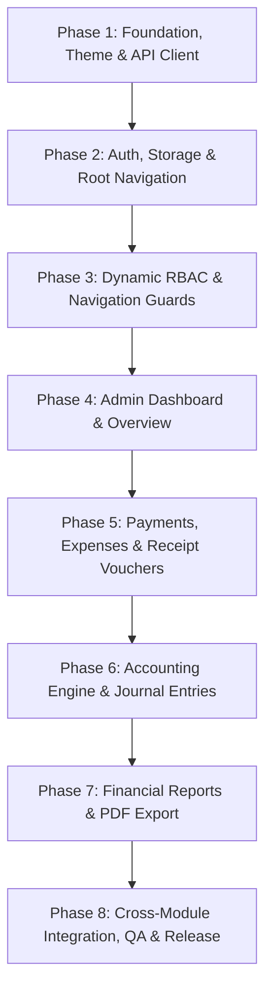

# HRSJM Admin Development — Phased Implementation Plan (`phase.md`)

**Platform:** React Native CLI (Android & iOS)  
**Target Backend:** `HRSJM-back-api` (`/api/v1`)  
**Lead / Architect:** Mubasshir  
**Version:** 1.0.0 — September 2026  

---

## 📌 Phase Overview & Dependency Hierarchy

---

## 💡 Core Execution Rule: Side-by-Side API Integration
Every UI screen, form, and component MUST be developed and integrated with its corresponding backend API endpoint (`HRSJM-back-api` `/api/v1`) **side-by-side** concurrently:
- **No Static/Mock-Only UI**: Do not develop isolated placeholder UI screens without hooking up real API service layers.
- **Unified Implementation**: DTO type definitions, React Query / Axios services, loading/empty/error states, debounced search, and error banners must be completed alongside the screen in each phase.
- **Immediate Contract Verification**: Validate payload structures and response schemas directly against `/api/v1` during screen construction.

---

## Phase 1: Foundation, Design Tokens & API Client

### Objective
Establish the project architecture, design tokens, common base components, and the centralized Axios network infrastructure with interceptors.

### Deliverables
- [x] Directory structure setup (`src/app`, `src/core`, `src/features`, `src/assets`).
- [x] Theme configuration (`AdminColors`, Typography, Spacing, Tokens).
- [x] Core utilities (`currency.ts` with `formatINR`, `date.ts`, `validators.ts`, `debounce.ts`).
- [x] Centralized Axios Client (`src/core/api/client.ts`).
- [x] Interceptors:
  - `auth.interceptor.ts` (Bearer token attachment).
  - `refresh.interceptor.ts` (Automatic 401 JWT refresh rotation).
  - `error.interceptor.ts` (Standardized `ApiError` normalization).
- [x] Core Common UI Components:
  - `AppHeader`, `AppButton`, `AppIconButton`, `AppInput`, `AppCard`, `AppBadge`, `AppAvatar`, `AppSearchBar`.
  - `AppLoader`, `AppEmptyState`, `AppErrorState`, `SkeletonCard`, `NetworkBanner`.

### Success Criteria
- Clean TypeScript compilation without errors.
- API client correctly formats endpoints with `/api/v1` base URL and standard response envelopes.

---

## Phase 2: Authentication, Secure Storage & Navigation Flow

### Objective
Implement secure credential handling, session restoration, authentication screens, and root routing.

### Deliverables
- [ ] Secure Storage Service (`react-native-keychain` / `react-native-mmkv`).
- [ ] Auth Zustand Store (`authStore.ts`) & `useAuth` hook.
- [ ] Auth Service (`auth.service.ts`):
  - `POST /api/v1/auth/login`
  - `POST /api/v1/auth/forgot-password`
  - `POST /api/v1/auth/reset-password`
  - `GET /api/v1/auth/me`
  - `POST /api/v1/auth/logout`
- [ ] Screens:
  - `SplashScreen.tsx` (Token validation & initial route determination).
  - `OnboardingScreen.tsx`.
  - `LoginScreen.tsx` (Form validation, password toggle, biometric login trigger).
  - `ForgotPasswordScreen.tsx`.
  - `ResetPasswordScreen.tsx`.
- [ ] Navigation Stacks:
  - `RootNavigator.tsx` (Auth vs App switching).
  - `AuthNavigator.tsx`.

### Success Criteria
- Valid login sets access token in memory and refresh token in secure storage.
- App relaunch automatically validates session and navigates to the appropriate dashboard.
- 401 responses trigger silent token refresh without logging out active users.

---

## Phase 3: Dynamic RBAC & Navigation Guards

### Objective
Implement dynamic permission resolution from backend responses and establish role/permission-aware navigation.

### Deliverables
- [ ] Dynamic Permission Service & `can()` helper:
  - `can('permission.key')` evaluation.
  - `permission.guard.ts` for route-level protection.
- [ ] Navigation Infrastructure:
  - `AdminTabNavigator.tsx` (5 Bottom Tabs: Dashboard, Members, Applications, Complaints, More).
  - `MoreNavigator.tsx` (Central hub for financial, accounting, and system modules).
  - Strongly typed route parameters (`NavigationTypes.ts`).
- [ ] Dynamic UI wrappers:
  - Action buttons and menu items conditionally rendered based on permissions.

### Success Criteria
- Admin users see only actions corresponding to their backend-assigned permissions.
- Direct navigation to unauthorized routes is blocked with appropriate feedback.

---

## Phase 4: Admin Dashboard

### Objective
Build the comprehensive executive dashboard showing high-level community metrics, revenue summaries, pending approval queues, and recent activity.

### Deliverables
- [ ] Dashboard Service (`GET /api/v1/users`, `GET /api/v1/memberships`, `GET /api/v1/receipts`).
- [ ] Dashboard UI Components:
  - `DashboardStats.tsx` (4 stat cards: Total, Active, Expiring, Inactive).
  - `RevenueSummary.tsx` (Membership income, donation income, net balance).
  - `PendingActions.tsx` (Quick access badges for pending approvals).
  - `RecentActivity.tsx` (Feed of last 10 system actions).
- [ ] Pull-to-refresh & skeleton shimmer loading states.
- [ ] Screen: `AdminDashboardScreen.tsx`.

### Success Criteria
- Metrics accurately reflect server data.
- Tapping on a pending action badge routes directly to the relevant approval queue.

---

## Phase 5: Payment Verification & Voucher Management

### Objective
Deliver the financial verification workflows for offline/online payments, expense vouchers, and manual receipt vouchers.

### Deliverables
- [ ] **Payment Verification**:
  - `GET /api/v1/membership-payments` (with search, status filters, pagination).
  - `POST /api/v1/membership-payments/:id/verify` (Idempotent verification).
  - `PaymentVerificationScreen.tsx`, `PaymentDetailsScreen.tsx`, `VerifyPaymentModal.tsx`.
- [ ] **Expense Vouchers**:
  - `GET /api/v1/expense-entries`
  - `POST /api/v1/expense-entries` (Dr Expense Account / Cr Bank/Cash Account).
  - `ExpenseVouchersScreen.tsx`, `CreateExpenseVoucherScreen.tsx`, `ExpenseDetailsScreen.tsx`.
- [ ] **Receipt Vouchers**:
  - `GET /api/v1/receipt-entries`
  - `POST /api/v1/receipt-entries` (Dr Bank/Cash / Cr Income Account).
  - `ReceiptVouchersScreen.tsx`, `CreateReceiptVoucherScreen.tsx`, `ReceiptVoucherDetailsScreen.tsx`.

### Success Criteria
- Payments can be filtered by `ALL`, `PENDING`, `VERIFIED`, `FAILED`.
- Verified payments generate receipts and journal records on the backend.
- Vouchers validate debits/credits and prevent duplicate submissions.

---

## Phase 6: Accounting Engine & Journal Entries

### Objective
Implement double-entry bookkeeping interfaces including Chart of Accounts, General Ledger, and Journal Entries.

### Deliverables
- [ ] **Chart of Accounts (COA)**:
  - `GET /api/v1/accounts`
  - Interactive hierarchical tree component (`AccountTree.tsx`, `AccountRow.tsx`).
- [ ] **General Ledger**:
  - `GET /api/v1/accounting/ledger` & `GET /api/v1/accounts/:id/ledger`
  - Date range filters, opening balance, debit/credit rows, closing balance.
- [ ] **Journal Entries & Reversals**:
  - `GET /api/v1/accounting/entries`
  - `POST /api/v1/accounting/entries/:id/reverse` (Mirror reversal flow).
  - `JournalEntriesScreen.tsx`, `ReverseEntryModal.tsx`.

### Success Criteria
- Chart of Accounts correctly renders parent-child hierarchy dynamically from API.
- Journal entry reversal creates mirror accounting entries and updates ledger balances.

---

## Phase 7: Financial Reports & PDF Export

### Objective
Implement financial statement reporting with date filters, balance validations, and PDF download/sharing.

### Deliverables
- [ ] **Trial Balance**:
  - `GET /api/v1/reports/trial-balance` (Debit & Credit totals match verification).
  - `TrialBalanceScreen.tsx`.
- [ ] **Profit & Loss (P&L)**:
  - `GET /api/v1/reports/profit-loss` (Income vs Expenses breakdown & Net Surplus).
  - `ProfitLossScreen.tsx`.
- [ ] **Balance Sheet**:
  - `GET /api/v1/reports/balance-sheet` (Assets = Liabilities + Equity balance verification).
  - `BalanceSheetScreen.tsx`.
- [ ] PDF Generation and native device Share Sheet integration (`ExportReportButton.tsx`).

### Success Criteria
- Financial reports accurately render dynamic calculations from backend APIs.
- PDF exports trigger native share sheets smoothly on both Android and iOS.

---

## Phase 8: RBAC Management, Integration & Release Readiness

### Objective
Implement full roles and permission administration, coordinate team integration, perform end-to-end testing, and prepare release builds.

### Deliverables
- [ ] **Roles & Permissions Management**:
  - `GET/POST/PATCH/DELETE /api/v1/roles` (Protected system roles: `ADMIN`, `MEMBER`, `DONOR`, `SEEKER`).
  - `GET /api/v1/permissions` (Catalog with search & category groupings).
  - `POST /api/v1/users/:id/roles` (Assign/revoke user roles).
  - `RolesPermissionsScreen.tsx` (Roles, Permissions Catalog, User Role Assignments tabs).
- [ ] Cross-module integration with team members' modules (Members, Applications, Support).
- [ ] QA verification across Android physical devices/emulators and iOS simulators.
- [ ] ProGuard rules & release build configuration.

### Success Criteria
- 100% test cases passed from `BRD_Admin.md` test matrix.
- Zero TypeScript errors, clean linter execution, no memory leaks or unhandled promise rejections.
